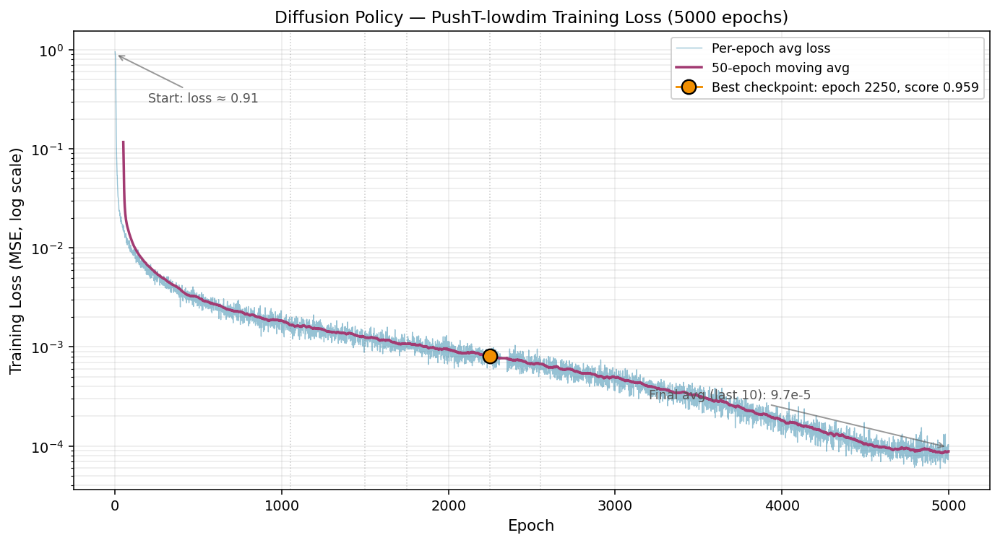

# Diffusion Policy — 精读笔记与本地复现

> 对 Chi et al., *Diffusion Policy: Visuomotor Policy Learning via Action Diffusion* (RSS 2023 / IJRR 2024) 的精读笔记、数学推导与 PushT-lowdim 任务在 **RTX 5060 Laptop (Blackwell sm_120)** 上的本地复现记录。
>
> 原论文: [arXiv:2303.04137](https://arxiv.org/abs/2303.04137) · 原作者 repo: [real-stanford/diffusion_policy](https://github.com/real-stanford/diffusion_policy)
>
> **本仓库不包含原论文代码**——所有原作者工作归原作者所有。本仓库只包含我在学习过程中产出的笔记、推导、架构图与复现结果。

---

## 差异化价值

这不是一次"调用 API 跑跑 demo"的复现。2023 年发布的代码要在 **2026 年的 Blackwell 架构**（RTX 50 系列）上跑起来，涉及：

- **GPU 架构 gap**: 原作者用 sm_86/sm_90，Blackwell 是 sm_120，原 PyTorch 1.12 + CUDA 11.6 完全不兼容
- **依赖生态漂移**: 三年间 conda / pip / numpy / huggingface-hub 都经历了破坏性变更
- **端到端验证**: matmul 测试通过 ≠ 训练能跑，必须做完整冒烟测试才能确认兼容性

把这些 gap 系统性解决并**真的跑出对标论文的成绩**，是比"运行官方训练脚本"更稀缺的工程能力。

---

## 复现结果摘要

- **任务**: PushT-lowdim (Push-T block, low-dim state observation)
- **架构**: CNN-based Diffusion Policy (1D temporal U-Net + FiLM)
- **训练时长**: 5000 epochs, ~24 小时
- **最佳成绩**: **test mean score 0.959 @ epoch 2250**

### 对标论文 Table 1 (PushT-ph)

| 指标 | 本次复现 | 论文报告 (DiffusionPolicy-C) |
|---|---|---|
| max score | **0.959** | 0.95 |
| score 稳定区间 (epoch 1050–2550) | 0.947 – 0.959 | — |
| 训练速度 | ~10.8 it/s | — |

### 训练曲线



Train loss 从 0.91 降到 9.7e-5（最后 10 epoch 平均），跨度接近 4 个数量级，无明显过拟合。最佳 checkpoint 出现在 epoch 2250 之后性能进入平台期，继续训练只降低 train loss 但不提高 rollout 成功率——与论文 Sec 5.2 "checkpoint selection" 观察一致。

---

## 硬件与环境

### 硬件

| 组件 | 规格 |
|---|---|
| GPU | NVIDIA GeForce RTX 5060 Laptop GPU (**Blackwell, sm_120**, 8GB) |
| CPU | Intel Core Ultra 9 275HX |
| RAM | 64 GB |
| OS | Windows 11 + WSL2 Ubuntu 22.04 |
| NVIDIA Driver | 592.01 (CUDA 13.1) |

**为什么用 WSL2 而不是 Windows 原生**: 原 `conda_environment.yaml` 依赖 `mujoco-py`, `pygame`, `pyvirtualdisplay` 等 Linux-only 预编译 wheel，Windows 原生 conda 会在多处编译失败。WSL2 + Linux Miniconda 是唯一符合作者原始环境的选择。

### 版本锁（可复现）

```yaml
# System
OS:              WSL2 Ubuntu 22.04
Python:          3.9.25
CUDA (runtime):  12.8

# Core ML — 必须原生支持 sm_120，PyTorch 1.x / 2.5 均不兼容
torch:           2.7.x+cu128
numpy:           1.23.5    # numba 0.56 的硬上限
numba:           0.56.4

# Diffusion Policy 关键锁定
diffusers:       0.11.1
huggingface-hub: 0.11.1    # 必须与 diffusers 0.11.1 配对，否则 HfFolder ImportError
hydra-core:      1.2.0
gym:             0.21.0

# 构建工具（为兼容老 gym 而降级）
setuptools:      65.5.0    # 66+ 不接受 gym 0.21 的旧 setup.py 语法
wheel:           0.38.4
pip:             <24.1     # 24.1+ metadata 严格检查会拒绝 gym 的非 PEP440 版本号

# 其他依赖
zarr:            2.12.0
numcodecs:       0.10.2
einops:          0.4.1
pymunk:          6.2.1
shapely:         1.8.4
accelerate:      0.13.2
wandb:           0.13.3
pandas:          1.5.3     # 官方 yaml 遗漏，需补装
```

### 关键兼容性结论

| Gap | 解决方向 |
|---|---|
| PyTorch 1.12 + CUDA 11.6 → Blackwell sm_120 不兼容 | 必须升级到 PyTorch ≥2.7 + CUDA 12.8（原生预编译 sm_120 的版本） |
| PyTorch 2.5.1 matmul 测试假阳性 | 部分 kernel 走 sm_90 PTX JIT 能通过，但 `x * scale + offset` 等操作无 PTX 兜底，训练启动后立即报 `no kernel image is available` |
| Conda 2024+ ToS 强制 | `conda tos accept --override-channels --channel https://repo.anaconda.com/pkgs/main` |
| NumPy 2.x 与老代码冲突 | `pip install numpy==1.23.5 --force-reinstall --no-deps` |
| gym 0.21 安装失败 | 必须 **同时** 降级 setuptools (<66)、wheel、pip (<24.1) 三者 |
| `HfFolder` ImportError | huggingface-hub 升到 1.x 后删除了该 API，锁回 0.11.1 |

---

## 仓库结构

```
diffusion-policy-study-notes/
├── README.md                               ← 本文件
├── notes/
│   ├── 01_ddpm_math_derivation.md          ← DDPM 数学推导（前向闭式解、L_simple、反向均值）
│   ├── 02_architecture_breakdown.md        ← 五组件架构与训练/推理数据流
│   ├── 03_code_location_map.md             ← 论文概念到代码位置的映射
│   └── 04_critique_and_open_questions.md   ← 批判性分析与待解问题
└── results/
    └── train_loss_curve.png                ← 5000 epoch 训练曲线
```

---

## 训练命令

```bash
# 下载官方实验 config（不要用命令行组合 config，会不一致）
wget -O lowdim_pusht_diffusion_policy_cnn.yaml \
  https://diffusion-policy.cs.columbia.edu/data/experiments/low_dim/pusht/diffusion_policy_cnn/config.yaml

# 后台启动训练
nohup python train.py \
    --config-dir=. \
    --config-name=lowdim_pusht_diffusion_policy_cnn.yaml \
    logging.mode=disabled \
    hydra.run.dir="data/outputs/pusht_lowdim_$(date +%Y%m%d_%H%M%S)" \
    > train.log 2>&1 &

tail -f train.log
```

Hydra 每 50 epoch 自动跑一次环境 rollout eval，把 top-k checkpoint 的 score 直接写进文件名，无需额外调用 `eval.py`。

---

## 我从这篇论文学到的东西

### 1. 论文核心定位

Diffusion Policy 把视觉运动策略建模为**以观测为条件、对动作序列去噪的扩散过程**。它解决了模仿学习中的三类困难：
- 动作分布的多模态性（同一观测下多种合理动作）
- 时序相关性（连续动作需要一致性）
- 高精度要求（接触丰富的操作任务）

扩散范式本身带来三个"红利"：可表达任意可归一化分布、支持高维输出、训练稳定（不需要估计 IBC 那种 intractable 的配分函数 Z）。这两组（任务固有困难 vs 方法红利）不应混淆，在写 related work 时需要分开陈述。

DP 自己的原创贡献是三个工程设计：**receding horizon control**、**visual conditioning**（区别于 Diffuser 的联合建模）、**time-series diffusion transformer**。

### 2. DDPM 数学推导

我推导并理解的核心公式：

```
前向单步:      x_t = √α_t · x_{t-1} + √(1-α_t) · ε_t
前向闭式解:    x_t = √ᾱ_t · x_0 + √(1-ᾱ_t) · ε,   ᾱ_t = Π α_s
训练 loss:     L_simple = ||ε - ε_θ(x_t, t)||²
反向均值:      μ_θ = (1/√α_t)(x_t - (1-α_t)/√(1-ᾱ_t) · ε_θ)
```

**设计逻辑链**（为什么 DDPM 长这样）：
1. 推理时没有 x_0，只能走 x_t → x_{t-1} 的反向链
2. 训练 loss 必须匹配 q(x_{t-1} | x_t, x_0) 这个反向条件分布
3. 贝叶斯反推：用已知的前向推出未知的反向，结果是高斯
4. 两个同方差高斯的 KL 等于均值的 MSE，所以只需匹配均值
5. 用 ε 重参数化均值最自然（尺度一致，对网络 friendly）
6. 丢掉 t 相关权重得到 L_simple（经验上更好）

详见 [notes/01_ddpm_math_derivation.md](notes/01_ddpm_math_derivation.md)。

### 3. 架构理解

**五个组件**: 观测编码器 → 时间步 embedding → 动作序列 → 噪声预测网络 ε_θ → Receding Horizon Controller

**关键接口**（CNN 和 Transformer 变体共享）:
```
ε_θ(A_t^k, O_t, k) → ε̂
输入: (带噪动作, 观测, 时间步)
输出: 同形状的预测噪声
```

**三个 horizon** 参数（PushT 默认）:
- `T_o = 2`（观测历史）
- `T_p = 16`（预测长度，保证时序一致性）
- `T_a = 8`（执行长度，保证响应性）

CNN 变体用 FiLM 做条件注入，Transformer 变体用 cross-attention——**功能同构，机制不同**。详见 [notes/02_architecture_breakdown.md](notes/02_architecture_breakdown.md)。

### 4. 代码结构

| 论文概念 | 代码位置 |
|---|---|
| 训练 loss (L_simple) | `diffusion_policy/policy/diffusion_unet_lowdim_policy.py::compute_loss` |
| 闭式解加噪 | `noise_scheduler.add_noise()` (HuggingFace diffusers) |
| U-Net 架构 | `diffusion_policy/model/diffusion/conditional_unet1d.py::ConditionalUnet1D` |
| FiLM 调制 | `ConditionalResidualBlock1D` 内 `scale * x + bias` |
| 推理循环 | `diffusion_unet_lowdim_policy.py::conditional_sample` |
| 反向均值公式 | `scheduler.step()` (DDPMScheduler / DDIMScheduler) |
| Receding horizon | `predict_action` 外层（`n_action_steps` 配置） |

详见 [notes/03_code_location_map.md](notes/03_code_location_map.md)。

### 5. 跨学科连接

- **玻尔兹曼分布 ↔ EBM**: `p = e^(-E)/Z` 直接来自统计物理，"配分函数" Z 的术语原封不动
- **Langevin 动力学 ↔ 扩散采样**: 随机分子动力学是扩散模型采样的数学前身
- **IBC 的 Z(o) 困境 ↔ DP 用梯度场绕过**: 取 log 对 a 求导，Z(o) 因不依赖 a 直接消为零，这是整个 score-based 方法的起点
- **经典 MPC ↔ Receding Horizon**: 论文 Sec 4.5 明确了与线性控制论的联系

---

## 我对这篇论文的批判性思考

精读的一个检验标准是能否指出论文的 limitation。以下是我能独立提出的几点：

1. **推理延迟**: T_p = 16、K = 100 次去噪，即使 DDIM 加速到 10 次，在高频控制场景（>100Hz）仍然受限。Sec 9 作者自己承认。
2. **行为克隆的本质缺陷**: DP 继承了 BC 的所有问题——次优示教数据导致次优策略、无自主探索、OOD 场景无能。不是 DP 独有，但仍是真实限制。
3. **视觉编码器选择缺乏解释**: Sec 5.4 的 ablation 显示"冻结 CLIP 不如从头训"，作者仅猜测"DP 偏好不同的视觉表示"。这是未解之谜，也是一个研究机会。
4. **条件注入方式仍是 heuristic**: FiLM 还是 cross-attention、注入哪几层、条件压缩程度——都没有理论指导，全靠调参。
5. **未显式建模动作轨迹的时序先验**: DP 的 1D CNN 是通用时序模型，没有利用"动作应该光滑连续"这种强先验。一个用 ODE/SDE 参数化的扩散模型可能更高效。

详见 [notes/04_critique_and_open_questions.md](notes/04_critique_and_open_questions.md)。

---

## 学习路径（给未来读者的建议）

如果你像我一样是没有 ML 背景的本科生，我的建议路径：

1. **第一天**: 精读 Abstract + Intro + Sec 2.1–2.3 + Sec 3.1 + Fig 1–2，建立宏观理解
2. **数学打通**: 推导 DDPM 的前向闭式解（用高斯叠加 + 归纳法）和 L_simple 的设计逻辑链
3. **架构理解**: 画出五组件数据流（训练 vs 推理两条），理解 FiLM 和 U-Net 的分工
4. **代码定位**: 找到 `compute_loss` / `ConditionalUnet1D` / `conditional_sample` 三个位置，不用读懂每行
5. **复现跑通**: 用原 repo 训练一个 lowdim 任务，对标论文 table

**不需要前置知识**（可以边学边补）:
- KL 散度（记住同方差高斯 KL = 均值 MSE / 2σ²）
- 贝叶斯公式（知道它能把反向条件分布用前向表达即可）
- VAE / ELBO（知道"最大化下界 = 间接最大化似然"）

**需要前置知识**:
- 数学分析（高斯分布的线性性质、方差计算）
- 线性代数（向量、矩阵基本运算）
- 深度学习基础（神经网络、反向传播、MSE loss）

---

## 致谢

- 感谢 Cheng Chi、Zhenjia Xu、Siyuan Feng 等原作者的卓越工作和开放的代码仓库
- 感谢精读过程中帮助我打通数学细节、澄清训练/推理场景区别的讨论伙伴

---

## License

本仓库的笔记、图表和文字内容采用 **CC BY 4.0** 许可（署名后可自由使用）。原论文和原代码的许可归原作者所有，请参考 [原作者 repo](https://github.com/real-stanford/diffusion_policy) 的 LICENSE。

---

**作者**: [@luojinfan95-cpu](https://github.com/luojinfan95-cpu) · 联系: luojinfan95@gmail.com

*最后更新: 2026-04-19*
